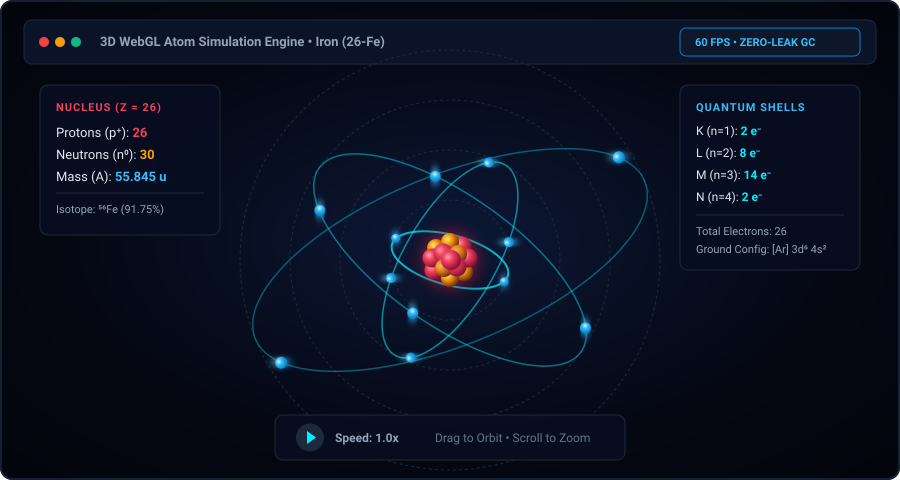
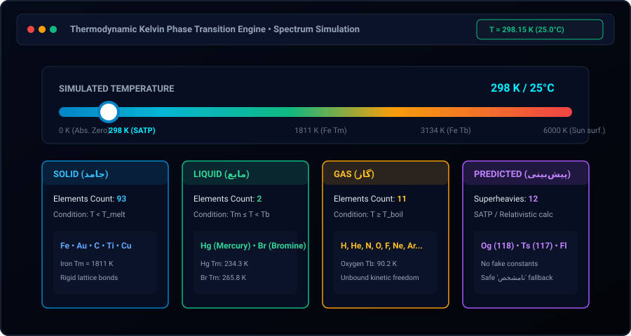

# Smart Periodic Table & 3D Chemical Engine

[](https://github.com/dibbed/smart-periodic-table-fullstack/actions)
[](https://nodejs.org/)
[](https://expressjs.com/)
[](https://react.dev/)
[](https://vitejs.dev/)
[](https://threejs.org/)
[](https://www.sqlite.org/)
[](https://tailwindcss.com/)
[](tests/)
[](LICENSE)

An enterprise-grade, full-stack computational chemistry suite and interactive 3D periodic table platform. Built with **React 18**, **Three.js (WebGL)**, **Node.js (>=22.5.0)**, **Express 4.21**, and **SQLite (WAL mode)**, this application merges chemical physics simulation with a modern, cross-platform web architecture.

---

## Table of Contents

- [Architectural Overview](#architectural-overview)
- [System Architecture](#system-architecture)
- [Directory Tree](#directory-tree)
- [Key Engineering Features](#key-engineering-features)
  - [1. Hardware-Accelerated 3D Atom Visualization (Zero Memory-Leak Lifecycle)](#1-hardware-accelerated-3d-atom-visualization-zero-memory-leak-lifecycle)
  - [2. Thermodynamic Kelvin Phase Transition Engine](#2-thermodynamic-kelvin-phase-transition-engine)
  - [3. Scientific Data Provenance & Anti-Hallucination Integrity](#3-scientific-data-provenance--anti-hallucination-integrity)
  - [4. Modern Cross-Platform Full-Stack Architecture](#4-modern-cross-platform-full-stack-architecture)
  - [5. Zero-Asset Web Audio API Synthesizer](#5-zero-asset-web-audio-api-synthesizer)
  - [6. Native Bi-Directional (RTL/Persian) & Keyboard-Driven UX](#6-native-bi-directional-rtlpersian--keyboard-driven-ux)
  - [7. Analytical Tooling: Matrix Comparison, Compound Builder & Quizzes](#7-analytical-tooling-matrix-comparison-compound-builder--quizzes)
- [Visual Showcase](#visual-showcase)
- [REST API Specification](#rest-api-specification)
  - [API Endpoints Summary](#api-endpoints-summary)
  - [Detailed Endpoint Contracts](#detailed-endpoint-contracts)
- [Data Provenance & Accuracy](#data-provenance--accuracy)
- [Quick Start & Local Setup](#quick-start--local-setup)
  - [Prerequisites](#prerequisites)
  - [Installation & Single-Command Launch](#installation--single-command-launch)
  - [Available NPM Scripts](#available-npm-scripts)
  - [Production Deployment](#production-deployment)
- [Quality Assurance & Automated Test Suite](#quality-assurance--automated-test-suite)
  - [Test Execution](#test-execution)
  - [Test Output Verification](#test-output-verification)
  - [Assertion Coverage Matrix](#assertion-coverage-matrix)
- [Security & Performance Hardening](#security--performance-hardening)
- [Author & License](#author--license)

---

## Architectural Overview

Most web-based periodic tables operate merely as static reference charts or cosmetic CSS layouts. **Smart Periodic Table & 3D Chemical Engine** is engineered as a computational chemistry tool and full-stack software system.

```
┌──────────────────────────────────────────────────────────────────────────────────┐
│                                CLIENT TIER                                       │
│  React 18 SPA  │  Three.js WebGL  │  Tailwind CSS  │  Web Audio API Synth        │
│  - Dynamic Kelvin Phase Calculation Engine                                       │
│  - Zero-Leak 3D WebGL Disposal Lifecycle & Geometry Garbage Collection           │
│  - Bi-Directional RTL/LTR Typography & Spatial Arrow-Key Grid Traversal         │
└────────────────────────────────────────┬─────────────────────────────────────────┘
                                         │ JSON over HTTP / REST (Vite Dynamic Proxy)
                                         ▼
┌──────────────────────────────────────────────────────────────────────────────────┐
│                                SERVER TIER                                       │
│  Node.js (>=22.5.0)  │  Express 4.21  │  Security Middleware                     │
│  - Root Entrypoint: server.js (native process.loadEnvFile())                     │
│  - Dynamic Three.js Geometry Payload Generator (Nucleons / Quantum Orbitals)     │
│  - Thermodynamic Phase Filter by Kelvin Temperature                              │
│  - Multi-Element Statistical Comparison Matrix Engine                            │
│  - Dynamic Fisher-Yates Assessment Quiz Generator                                │
└────────────────────────────────────────┬─────────────────────────────────────────┘
                                         │ High-Throughput In-Process Driver
                                         ▼
┌──────────────────────────────────────────────────────────────────────────────────┐
│                              PERSISTENCE TIER                                    │
│  SQLite Database Engine (Dual Driver: better-sqlite3 with node:sqlite fallback)  │
│  - PRAGMA journal_mode = WAL; (Concurrent Lock-Free Reads)                       │
│  - PRAGMA synchronous = NORMAL; PRAGMA cache_size = -64000; (64MB Cache)         │
│  - 118 Formally Verified Elements (Zero Fake Data Fabrication)                   │
└──────────────────────────────────────────────────────────────────────────────────┘
```

---

## System Architecture

The codebase enforces clean separation of concerns across presentation, business logic, persistence, and quality assurance layers:

```
├── client/spa        ──> React 18 SPA powered by Vite 6, Tailwind CSS & Lucide Icons
├── 3d-graphics       ──> Three.js r170 rendering pipeline with explicit GPU context cleanup
├── client/standalone ──> Fallback zero-build vanilla JS / Babel browser client in public/
├── server/backend    ──> Node.js (>=22.5.0) runtime running Express 4.21 REST endpoints
├── persistence       ──> SQLite relational store (better-sqlite3 / node:sqlite) with WAL journaling
├── verification      ──> Native Node.js Test Runner (node:test) + 4 enterprise audit suites
└── documentation     ──> Modular docs/ directory housing high-resolution vector assets
```

---

## Directory Tree

```bash
smart-periodic-table-fullstack/
├── .github/                              # Continuous Integration & Delivery
│   └── workflows/
│       └── ci.yml                        # Multi-platform CI matrix (Ubuntu, Windows, macOS)
├── data/                                 # Canonical Scientific Datasets & Persistence Store
│   ├── elements.json                     # Verified primary scientific source (118 elements)
│   ├── elements.seed.json                # Immutable fallback seed snapshot
│   ├── periodic-source-snapshot.json     # Experimental reference snapshot
│   ├── periodic_table.db                 # Production SQLite database file
│   ├── periodic_table.db-shm             # SQLite shared-memory index for WAL
│   ├── periodic_table.db-wal             # SQLite Write-Ahead Log journal
│   └── pubchem-periodic-table.json       # PubChem raw validation reference
├── dist/                                 # Vite Production Build Output
│   ├── assets/                           # Bundled chunks: React, Three.js, Lucide, CSS
│   └── index.html                        # Production single-page application entry
├── docs/                                 # Visual Assets & Architecture Graphics
│   ├── atom-3d.svg                       # Interactive 3D WebGL Atom Viewer vector preview
│   ├── modals.svg                        # Matrix comparison & quiz modal vector preview
│   └── temp-slider.svg                   # Thermodynamic Kelvin temperature slider vector preview
├── public/                               # Standalone Zero-Build Browser Client
│   ├── css/                              # Standalone CSS definitions & scanline animations
│   ├── index.html                        # Standalone HTML entrypoint (CDN-based React/Babel)
│   └── js/                               # Standalone modular JavaScript client files
├── scripts/                              # Verification & Lifecycle Automation Scripts
│   ├── generate-docs-assets.js           # Generates documentation vector assets in docs/
│   ├── reset-db.js                       # Database re-initialization and seed executor
│   ├── seed.js                           # Atomic seed coordinator with --reset support
│   ├── self-test.js                      # Core sanity and modularity invariant test
│   ├── verify-backend.js                 # Complete backend endpoint & database test suite
│   ├── verify-frontend.js                # Frontend component, hook & build auditor
│   └── verify-integration.js             # End-to-end HTTP and route verification script
├── server/                               # Backend Application Tier
│   ├── db/
│   │   └── database.js                   # SQLite abstraction, PRAGMA config, auto-seeding, Kelvin phase
│   ├── routes/
│   │   └── api.js                        # Express REST controllers & Three.js config builder
│   └── index.js                          # Express application entry, security headers, graceful shutdown
├── src/                                  # Modern Frontend Application Tier (React 18 + Vite)
│   ├── components/
│   │   ├── App.jsx                       # Application shell, state coordinator, shortcuts
│   │   ├── AtomViewer.jsx                # Three.js 3D atom model with zero-leak lifecycle
│   │   ├── CompareModal.jsx              # Multi-element analytical comparison modal
│   │   ├── CompoundBuilderModal.jsx      # Molar mass calculator & formula constructor
│   │   ├── ElementCard.jsx               # Periodic grid element card component
│   │   ├── PeriodicTable.jsx             # Periodic grid layout engine (Grid, Blocks, Phase)
│   │   └── QuizModal.jsx                 # Interactive assessment quiz modal
│   ├── services/
│   │   └── api.js                        # Client HTTP communication service
│   ├── utils/
│   │   ├── chemistry.js                  # Thermodynamic phase transitions & chemical constants
│   │   └── sound.js                      # Web Audio API singleton sound synthesizer
│   ├── index.css                         # Tailwind directives and custom animation styles
│   └── main.jsx                          # React DOM client mount root
├── tests/                                # Automated Test Tier (Native Node.js Test Runner)
│   ├── api.test.js                       # Scientific data guarantees, core API endpoints & 404 testing
│   └── elements.test.js                  # Comprehensive unit & database schema verification
├── .env.example                          # Environment variables template (PORT, HOST, CLIENT_URL)
├── .gitignore                            # Git exclusion rules
├── index.html                            # Vite dev index entrypoint
├── LICENSE                               # MIT License
├── package.json                          # Project dependencies, scripts, engines definition
├── postcss.config.js                     # PostCSS build pipeline configuration
├── server.js                             # Root server entrypoint delegating to server/index.js
├── tailwind.config.js                    # Tailwind CSS theme & plugin tokens
└── vite.config.js                        # Vite bundler configuration, reverse proxy & code-splitting
```

---

## Key Engineering Features

### 1. Hardware-Accelerated 3D Atom Visualization (Zero Memory-Leak Lifecycle)

The `AtomViewer` component renders a dynamic, interactive 3D model of any selected atom using **Three.js (WebGL)**:

1. **Procedural Nucleus (Fibonacci Spherical Spiral):** Protons (rose: `#f43f5e`, emissive `#881337`) and neutrons (amber: `#f59e0b`, emissive `#78350f`) are distributed homogeneously across a 3D spherical volume:
   $$\phi_i = \arccos\left(-1 + \frac{2i}{N}\right), \quad \theta_i = \sqrt{N\pi} \cdot \phi_i, \quad r_i = 0.4 \cdot \sqrt[3]{U(0, 1)}$$
   $$\mathbf{p}_i = \big(r_i \cos\theta_i \sin\phi_i,\; r_i \sin\theta_i \sin\phi_i,\; r_i \cos\phi_i\big)$$
   To guarantee steady 60 FPS performance without WebGL draw-call bottlenecks on heavy elements ($Z \ge 80$), visible nucleons are dynamically clamped:
   $$N = \min(A, 60), \quad p_{\text{vis}} = \operatorname{round}\left(\frac{N \cdot Z}{A}\right), \quad n_{\text{vis}} = N - p_{\text{vis}}$$
2. **Concentric Quantum Electron Shells:** Distinct Bohr-Rutherford rings representing primary quantum levels ($K, L, M, N, O, P, Q$) tilted across complementary axes ($\theta_x = \frac{n\pi}{6}, \theta_z = \frac{n\pi}{8}$) simulate 3D electron clouds without planar collision.
3. **Decoupled Animation Engine:** Rotation loops are decoupled from React state via mutable `useRef` bridges, preserving a smooth 60+ FPS animation rate even during intensive DOM updates.

#### Zero Memory-Leak Teardown Protocol

Single Page Applications rendering WebGL canvases frequently suffer from memory leaks caused by uncollected GPU contexts and retained geometry buffers. `AtomViewer` implements a strict 4-step teardown protocol upon element switch or component unmount:

```javascript
return () => {
  // 1. Terminate the requestAnimationFrame render loop
  if (animationFrameId !== null) {
    cancelAnimationFrame(animationFrameId);
  }

  // 2. Traverse scene graph and dispose all Geometries and Materials
  if (scene) {
    scene.traverse((object) => {
      if (object.isMesh) {
        if (object.geometry) object.geometry.dispose();
        if (object.material) {
          if (Array.isArray(object.material)) {
            object.material.forEach((mat) => mat.dispose());
          } else {
            object.material.dispose();
          }
        }
      }
    });
  }

  // 3. Trigger hardware WebGL context loss and remove Canvas from DOM
  if (renderer) {
    renderer.dispose();
    if (typeof renderer.forceContextLoss === 'function') {
      renderer.forceContextLoss();
    }
    try {
      const gl = renderer.getContext?.();
      gl?.getExtension('WEBGL_lose_context')?.loseContext?.();
    } catch {
      // Fallback for non-standard WebGL implementations
    }
    if (renderer.domElement?.parentNode) {
      renderer.domElement.parentNode.removeChild(renderer.domElement);
    }
  }

  // 4. Detach global and container event listeners
  window.removeEventListener('resize', handleResize);
  window.removeEventListener('mousemove', onMouseMove);
  window.removeEventListener('mouseup', onMouseUp);
  window.removeEventListener('touchmove', onTouchMove);
  window.removeEventListener('touchend', onTouchEnd);
};
```

---

### 2. Thermodynamic Kelvin Phase Transition Engine

Rather than displaying static room-temperature states, the application evaluates an element's thermodynamic state as a piecewise continuous function of temperature ($T$ in Kelvin):

$$\text{Phase}(T) = \begin{cases} 
\text{Solid (جامد)} & \text{if } T_{\text{melt}} \text{ is known and } T < T_{\text{melt}} \\ 
\text{Liquid (مایع)} & \text{if } T_{\text{melt}} \le T < T_{\text{boil}} \\ 
\text{Gas (گاز)} & \text{if } T_{\text{boil}} \text{ is known and } T \ge T_{\text{boil}} \\ 
\text{Predicted (پیش‌بینی)} & \text{if } |T - 298.15\,\text{K}| \le 5\,\text{K} \text{ and standard state has predicted flag} \\
\text{Unknown (نامشخص)} & \text{otherwise (unmeasured parameters outside SATP)}
\end{cases}$$

```javascript
/**
 * Calculates thermodynamic phase at temperature T (Kelvin).
 * Source: src/utils/chemistry.js
 */
export const getPhaseAtTemp = (el, tempK) => {
  if (!el) return 'نامشخص';
  const melt = Number.isFinite(el.meltingPoint) ? el.meltingPoint : null;
  const boil = Number.isFinite(el.boilingPoint) ? el.boilingPoint : null;

  if (melt !== null && boil !== null) {
    if (tempK < melt) return 'جامد';
    if (tempK < boil) return 'مایع';
    return 'گاز';
  }

  // Boundary preservation: single-point known transitions
  if (melt !== null && tempK < melt) return 'جامد';
  if (boil !== null && tempK >= boil) return 'گاز';

  // Standard Ambient Temperature & Pressure (SATP: 298.15 K +- 5 K)
  if (Math.abs(tempK - 298) <= 5 && el.standardState) {
    const state = String(el.standardState).toLowerCase();
    const predicted = state.includes('expected') || state.includes('predicted');
    if (state.includes('solid')) return predicted ? 'پیش‌بینی: جامد' : 'جامد';
    if (state.includes('liquid')) return predicted ? 'پیش‌بینی: مایع' : 'مایع';
    if (state.includes('gas')) return predicted ? 'پیش‌بینی: گاز' : 'گاز';
  }

  return 'نامشخص';
};
```

The thermodynamic engine operates both **client-side** (in `src/utils/chemistry.js` and `PeriodicTable.jsx`) for instantaneous slider interactions ($0\,\text{K}$ to $6000\,\text{K}$) and **server-side** via `/api/elements?temperature=...&phase=...` query parameters.

---

### 3. Scientific Data Provenance & Anti-Hallucination Integrity

The platform strictly prohibits speculative data fabrication:

- **Mathematical Electron Summation:** Every element adheres to charge conservation for neutral ground-state atoms:
  $$\sum_{k=1}^{n} \text{shells}[k] = Z = \text{protons} = \text{electrons}$$
- **Authentic Superheavy Elements Handling:** Elements with $Z \ge 100$ (Fermium through Oganesson) lacking empirical thermodynamic data have their properties explicitly set to `null` and flagged with `isPredicted: true`.
- **Zero Fake Values:** No fabricated placeholders (e.g. fake `[Z=...]` configurations, synthetic density numbers, or made-up boiling points) exist in the database.
- **Empirical Reference Alignment:** Reference elements (Hydrogen, Iron, Gold, Uranium) match verified empirical physical measurements (NIST, IUPAC, PubChem).

---

### 4. Modern Cross-Platform Full-Stack Architecture

The system has been completely decoupled from platform-specific assumptions:

- **Removal of Legacy Scripts:** Obsolete `.bat` scripts (`start_windows.bat`) and legacy unmaintained directories (`lib/`) were eliminated. The entire application boots across Windows, Linux, and macOS via standard `npm` commands.
- **Root Entrypoint (`server.js`):** Loads environment variables using Node.js native `process.loadEnvFile()`, eliminating third-party `dotenv` dependencies and binding directly to `server/index.js`.
- **Dynamic Reverse Proxy (`vite.config.js`):** In development, Vite dynamically proxies all `/api` requests to the Express backend port (`PORT` or 3000/5000), eliminating CORS overhead and preventing hardcoded port mismatches.
- **Enterprise SQLite Persistence:** High-throughput transactional data store utilizing SQLite in Write-Ahead Logging (`WAL`) mode with automatic in-process fallback between `better-sqlite3` and Node.js 22's native `node:sqlite` (`DatabaseSync`):
  ```javascript
  let DatabaseClient;
  let engineName = 'better-sqlite3';

  try {
    DatabaseClient = require('better-sqlite3');
  } catch (err) {
    const { DatabaseSync } = require('node:sqlite');
    DatabaseClient = DatabaseSync;
    engineName = 'node:sqlite';
  }
  ```
- **High-Performance PRAGMAs:**
  ```sql
  PRAGMA journal_mode = WAL;
  PRAGMA foreign_keys = ON;
  PRAGMA synchronous = NORMAL;
  PRAGMA cache_size = -64000; -- 64MB memory cache
  PRAGMA temp_store = MEMORY;
  ```
- **Cross-Platform CI Pipeline:** GitHub Actions matrix workflow (`.github/workflows/ci.yml`) runs on `ubuntu-latest`, `windows-latest`, and `macos-latest` on every commit and pull request.

---

### 5. Zero-Asset Web Audio API Synthesizer

To deliver an engaging tactile audio experience without downloading external MP3 or WAV files over the network, the project features a custom Web Audio API singleton synthesizer (`src/utils/sound.js`):

- **Pure Waveform Generation:** Uses `Sine`, `Triangle`, and `Sawtooth` oscillators.
- **Exponential Envelope Decays:** Natural sound dampening using `.exponentialRampToValueAtTime()`.
- **Low Latency (<1ms):** Micro-interactions for hover, element selection, modal toggles, and quiz evaluations.

---

### 6. Native Bi-Directional (RTL/Persian) & Keyboard-Driven UX

- **Bilingual Interface:** Primary Persian typography using the clean, modern Vazirmatn font paired with internationally recognized IUPAC chemical nomenclature and English symbols.
- **Spatial Arrow-Key Navigation:** Move across the periodic table using `ArrowUp`, `ArrowDown`, `ArrowLeft`, and `ArrowRight`, mapping intuitively across rows and periods.
- **Global Shortcuts:** Press `/` to focus the search bar instantly; press `Escape` to close any active modal.
- **Cyberpunk Dark Aesthetics:** High-contrast color scales for elemental series, electron shells, and thermodynamic phases.

---

### 7. Analytical Tooling: Matrix Comparison, Compound Builder & Quizzes

1. **Multi-Element Comparative Matrix (`POST /api/compare`):** Select up to 20 elements to compute comparative metrics including atomic mass, density, melting/boiling points, electronegativity, ionization energy, and atomic radius. Automatically calculates minimums, maximums, and mathematical deltas ($\Delta$).
2. **Compound Builder & Molar Mass Calculator:** Construct complex chemical formulas (e.g., $\text{H}_2\text{SO}_4$, $\text{C}_6\text{H}_{12}\text{O}_6$) and dynamically calculate total molar masses with preset support.
3. **Dynamic Assessment Engine (`GET /api/quiz`):** Procedural four-option quiz generator evaluating knowledge across 6 domains: chemical symbols, atomic numbers, element names, classification categories, subshell blocks ($s, p, d, f$), and periods. Employs Fisher-Yates array shuffling to ensure unbiased distractors.

---

## Visual Showcase

<div align="center">

### 1. Interactive 3D WebGL Atom Simulation
> *Real-time rendering of electron shells, orbital tilts, and packed nucleons with zero-leak WebGL garbage collection.*

<a href="docs/atom-3d.svg">
  
</a>

<details>
<summary><b>Drop-in Live Media Replacement Guide</b></summary>
<p align="left">
To showcase a live animation recording, place your screen-captured GIF at <code>docs/atom-3d.gif</code> and reference it:
<br/>
<code>&lt;img src="docs/atom-3d.gif" alt="3D Atom Viewer GIF" width="850" /&gt;</code>
</p>
</details>

<br />

### 2. Thermodynamic Kelvin Phase Transition Slider
> *Dynamic phase state changes simulated across the temperature spectrum from 0 K to 6000 K.*

<a href="docs/temp-slider.svg">
  
</a>

<details>
<summary><b>Drop-in Live Media Replacement Guide</b></summary>
<p align="left">
To showcase the dynamic phase slider in action, place your recording at <code>docs/temp-slider.gif</code> and reference it:
<br/>
<code>&lt;img src="docs/temp-slider.gif" alt="Temperature Filter Slider GIF" width="850" /&gt;</code>
</p>
</details>

<br />

### 3. Analytical Suite: Matrix Comparison, Quiz & Compound Builder
> *Statistical metric matrix analysis, dynamic quiz assessment with Fisher-Yates distractors, and stoichiometric formula calculator.*

<a href="docs/modals.svg">
  
</a>

<details>
<summary><b>Drop-in Live Media Replacement Guide</b></summary>
<p align="left">
To showcase the analytical modal windows, place your screenshot at <code>docs/modals.png</code> and reference it:
<br/>
<code>&lt;img src="docs/modals.png" alt="Modals & Analytics Screenshot" width="850" /&gt;</code>
</p>
</details>

</div>

---

## REST API Specification

### API Endpoints Summary

| Method | Endpoint | Query / Body Parameters | Description | Status Codes |
| :--- | :--- | :--- | :--- | :--- |
| **`GET`** | `/api/health` | *None* | Evaluates service health, SQLite connection, and total seeded elements. | `200`, `503` |
| **`GET`** | `/api/elements` | `category`, `phase`, `temperature`, `block`, `period`, `group`, `q` | Retrieves all 118 elements with optional scientific, temperature, and textual filters. | `200`, `400`, `500` |
| **`GET`** | `/api/elements/:id` | Route param: `:id` (atomic number, symbol, or name) | Returns element record augmented with Three.js orbital visualization coordinates. | `200`, `404`, `500` |
| **`GET`** | `/api/search` | `q` (Search keyword string) | Performs fast indexed search matching atomic number, symbol, English, or Persian name. | `200`, `500` |
| **`GET`** | `/api/quiz` | `count` *(1-50)*, `type` *(symbol, name, atomicNumber, category, block, period, mixed)* | Generates dynamic multiple-choice questions with Fisher-Yates distractors. | `200`, `500`, `503` |
| **`POST`** | `/api/compare` | Body: `{ "ids": [1, 6, 26] }` or `[1, "Au", "Fe"]` *(Max 20 items)* | Computes statistical comparison matrix (min, max, delta, highlights) across properties. | `200`, `400`, `404`, `500` |

---

### Detailed Endpoint Contracts

#### 1. System Health & Persistence Status
`GET /api/health`

Evaluates operational status, active SQLite persistence driver, and verifies that the database contains all 118 IUPAC elements.

```json
{
  "ok": true,
  "status": "healthy",
  "database": "sqlite",
  "elements": 118,
  "timestamp": "2026-09-11T14:20:00.000Z"
}
```

---

#### 2. Filtered Elements Collection & Kelvin Phase Simulation
`GET /api/elements`

Supports multi-dimensional filtering across physical state, Kelvin temperature, chemical series, quantum blocks, periods, groups, or textual keywords.

**Query Parameters:**
- `category` *(optional)*: e.g. `noble-gas`, `transition-metal`, `alkali-metal`, or Persian equivalent `گاز نجیب`.
- `phase` *(optional)*: `gas`, `liquid`, `solid`, or Persian `گاز`, `مایع`, `جامد`.
- `temperature` / `temp` *(optional)*: Kelvin temperature (e.g. `300`, `20`, `2000`). Must be a non-negative number ($\ge 0\,\text{K}$). When provided, evaluates dynamic thermodynamic phase at that temperature. Returns `400 Bad Request` if negative or non-numeric.
- `block` *(optional)*: `s`, `p`, `d`, `f`.
- `period` *(optional)*: Integer `1` to `7`.
- `group` *(optional)*: Integer `1` to `18`.
- `q` / `search` *(optional)*: Substring query matching symbol, English, or Persian name.

**Example Request:** `GET /api/elements?phase=liquid&temperature=298`

**Response (`200 OK`):**
```json
[
  {
    "number": 35,
    "symbol": "Br",
    "nameFa": "برم",
    "nameEn": "Bromine",
    "group": 17,
    "period": 4,
    "category": "halogen",
    "block": "p",
    "atomicMass": 79.904,
    "density": 3.1028,
    "meltingPoint": 265.8,
    "boilingPoint": 332,
    "standardState": "Liquid",
    "electronConfig": "[Ar] 4s2 3d10 4p5",
    "protons": 35,
    "electrons": 35,
    "neutrons": 45,
    "shells": [2, 8, 18, 7],
    "isPredicted": false,
    "phaseAtTemp": "liquid"
  },
  {
    "number": 80,
    "symbol": "Hg",
    "nameFa": "جیوه",
    "nameEn": "Mercury",
    "group": 12,
    "period": 6,
    "category": "transition-metal",
    "block": "d",
    "atomicMass": 200.592,
    "density": 13.5336,
    "meltingPoint": 234.32,
    "boilingPoint": 629.88,
    "standardState": "Liquid",
    "electronConfig": "[Xe] 6s2 4f14 5d10",
    "protons": 80,
    "electrons": 80,
    "neutrons": 121,
    "shells": [2, 8, 18, 32, 18, 2],
    "isPredicted": false,
    "phaseAtTemp": "liquid"
  }
]
```

---

#### 3. Single Element with Three.js Geometry Payload
`GET /api/elements/:id`

Resolves element records by atomic number (e.g. `26`), IUPAC symbol (e.g. `Fe`), English name (`Iron`), or Persian name (`آهن`). Augments the record with procedural 3D coordinates, Bohr-Rutherford electron shells, tilt angles, and Fibonacci nucleon clustering configurations.

**Example Request:** `GET /api/elements/26`

**Response (`200 OK`):**
```json
{
  "number": 26,
  "symbol": "Fe",
  "nameFa": "آهن",
  "nameEn": "Iron",
  "group": 8,
  "period": 4,
  "category": "transition-metal",
  "block": "d",
  "atomicMass": 55.845,
  "density": 7.874,
  "meltingPoint": 1811,
  "boilingPoint": 3134,
  "protons": 26,
  "electrons": 26,
  "neutrons": 30,
  "shells": [2, 8, 14, 2],
  "isPredicted": false,
  "threeJsConfig": {
    "protons": 26,
    "neutrons": 30,
    "electrons": 26,
    "shells": [2, 8, 14, 2],
    "shellCount": 4,
    "nucleus": {
      "totalNucleons": 56,
      "visibleProtons": 26,
      "visibleNeutrons": 30,
      "representativeIsotope": 56
    },
    "orbitals": [
      {
        "shellIndex": 1,
        "shellLetter": "K",
        "electronCount": 2,
        "radius": 1.5,
        "tiltX": 0,
        "tiltZ": 0,
        "rotationSpeed": 0.025
      },
      {
        "shellIndex": 2,
        "shellLetter": "L",
        "electronCount": 8,
        "radius": 2.25,
        "tiltX": 0.5236,
        "tiltZ": 0.3927,
        "rotationSpeed": 0.0125
      }
    ]
  }
}
```

---

#### 4. Fast Indexed Search
`GET /api/search?q=:query`

Performs high-speed indexed lookups matching atomic number, chemical symbol, English name, and Persian name prefix/substrings.

**Example Request:** `GET /api/search?q=Gold`

**Response (`200 OK`):**
```json
[
  {
    "number": 79,
    "symbol": "Au",
    "nameFa": "طلا",
    "nameEn": "Gold",
    "category": "transition-metal",
    "group": 11,
    "period": 6,
    "atomicMass": 196.96657
  }
]
```

---

#### 5. Dynamic Procedural Assessment Quiz
`GET /api/quiz`

Generates multiple-choice questions evaluating domain mastery across chemical symbols, atomic numbers, names, categories, blocks, and periods. Employs Fisher-Yates shuffling for unbiased distractors.

**Query Parameters:**
- `count` *(optional, default 10, range 1-50)*: Number of generated questions.
- `type` / `mode` *(optional, default 'mixed')*: `symbol`, `name`, `atomicNumber`, `category`, `block`, `period`, `mixed`.
- `format` *(optional)*: Set to `object` to wrap in a metadata envelope `{ success, count, questions }`.

**Example Request:** `GET /api/quiz?count=1&type=block`

**Response (`200 OK`):**
```json
[
  {
    "id": 1,
    "type": "block",
    "question": "عنصر «آهن» (Fe) در کدام بلوک الکترونی جدول تناوبی قرار دارد؟",
    "element": {
      "number": 26,
      "symbol": "Fe",
      "nameFa": "آهن",
      "nameEn": "Iron"
    },
    "options": ["بلوک S", "بلوک D", "بلوک P", "بلوک F"],
    "correctAnswer": "بلوک D",
    "explanation": "الکترون ظرفیت عنصر آهن در زیرلایه d قرار می‌گیرد (بلوک D)."
  }
]
```

---

#### 6. Multi-Element Comparative Matrix Analysis
`POST /api/compare`  
*Headers: `Content-Type: application/json`*

Accepts an array of element identifiers (atomic numbers or symbols, up to 20 elements). Computes physical property minimums, maximums, and mathematical deltas ($\Delta$) along with Persian summary highlights.

**Example Payload:**
```json
{
  "ids": [1, 6, 26]
}
```

**Response (`200 OK`):**
```json
{
  "success": true,
  "count": 3,
  "elements": [ ... ],
  "comparison": {
    "atomicMass": {
      "available": true,
      "min": { "number": 1, "symbol": "H", "nameEn": "Hydrogen", "nameFa": "هیدروژن", "value": 1.008 },
      "max": { "number": 26, "symbol": "Fe", "nameEn": "Iron", "nameFa": "آهن", "value": 55.845 },
      "delta": 54.837,
      "values": [
        { "number": 1, "symbol": "H", "value": 1.008 },
        { "number": 6, "symbol": "C", "value": 12.011 },
        { "number": 26, "symbol": "Fe", "value": 55.845 }
      ]
    },
    "meltingPoint": {
      "available": true,
      "min": { "number": 1, "symbol": "H", "value": 13.99 },
      "max": { "number": 6, "symbol": "C", "value": 3823 },
      "delta": 3809.01,
      "values": [ ... ]
    }
  },
  "summary": [
    "سنگین‌ترین عنصر: آهن (Fe) با جرم 55.845 u",
    "سبک‌ترین عنصر: هیدروژن (H) با جرم 1.008 u",
    "بیشترین الکترونگاتیوی: کربن (C) با مقدار 2.55",
    "بیشترین چگالی: آهن (Fe) با 7.874 g/cm³",
    "بیشترین دمای ذوب: کربن (C) با 3823 K"
  ]
}
```

---

## Data Provenance & Accuracy

All chemical and physical properties curated within this project adhere strictly to peer-reviewed scientific sources:

- **IUPAC Periodic Table of Elements (2024 Release):** Standard atomic weights, group/period assignments, and nomenclature.
- **NIST Physical Reference Data (Standard Reference Database 144):** Ground-state electron configurations, ionization energies, and atomic spectra.
- **PubChem Periodic Table Data API (National Library of Medicine):** Empirical densities, melting points, boiling points, and electronegativities.
- **WebElements & Los Alamos National Laboratory Chemistry Division:** Historical discovery provenance, isotope representations, and industrial applications.

---

## Quick Start & Local Setup

### Prerequisites

- **Node.js:** `>= 22.5.0` (LTS recommended)
- **Package Manager:** `npm` (v10+ bundled with Node.js)
- **Supported Platforms:** Windows 10/11, macOS, Linux (Zero platform dependencies)

### Installation & Single-Command Launch

1. **Clone the repository:**
   ```bash
   git clone https://github.com/dibbed/smart-periodic-table-fullstack.git
   cd smart-periodic-table-fullstack
   ```

2. **Install dependencies:**
   ```bash
   npm install
   ```

3. **Start development environment:**
   ```bash
   npm run dev
   ```

   *`npm run dev` boots both the Express backend on `http://127.0.0.1:3000` and the Vite dev server on `http://localhost:5173` concurrently.*

4. Open your browser and navigate to:
   ```
   http://localhost:5173
   ```

---

### Available NPM Scripts

| Script | Command | Purpose |
| :--- | :--- | :--- |
| **`npm run dev`** | `concurrently ...` | Concurrently boots backend on `:3000` and Vite HMR client on `:5173`. |
| **`npm run dev:server`**| `cross-env NODE_ENV=development node --no-warnings server.js` | Launches Express backend in development mode. |
| **`npm run dev:client`**| `cross-env NODE_ENV=development vite` | Launches Vite frontend with Hot Module Replacement. |
| **`npm test`** | `node --test tests/api.test.js tests/elements.test.js` | Runs both automated test suites via native Node.js Test Runner. |
| **`npm run test:api`** | `node --test tests/api.test.js` | Runs scientific integrity and core API endpoint tests. |
| **`npm run test:unit`**| `node --test tests/api.test.js tests/elements.test.js` | Alias for primary unit and integration tests. |
| **`npm run test:all`** | *Multiple verification runners* | Executes full test pipeline (API, Unit, Invariants, Backend, Frontend, Integration). |
| **`npm run build`** | `vite build` | Compiles and chunks React SPA into production-ready `dist/` bundle. |
| **`npm start`** | `node --no-warnings server.js` | Boots production server serving API and `dist/` static files. |
| **`npm run seed`** | `node --no-warnings scripts/seed.js` | Runs database migrations and seeds verified 118 elements atomically. |
| **`npm run reset-db`**| `node --no-warnings scripts/seed.js --reset` | Drops existing database tables, creates schema, and re-seeds. |
| **`npm run clean`** | `node -e "..."` | Deletes `dist/` and legacy directories cleanly cross-platform. |

---

### Production Deployment

To compile and serve the production build:

```bash
# 1. Build optimized React bundle into dist/
npm run build

# 2. Run production server
npm start
```

*The production server serves both the REST API and the production SPA from `http://127.0.0.1:3000`.*

---

## Quality Assurance & Automated Test Suite

The platform utilizes the built-in **Node.js Test Runner (`node:test`)** and **`node:assert/strict`**, eliminating heavy testing framework dependencies while achieving execution speeds (<650ms) with zero overhead.

### Test Execution

```bash
# Run both automated test suites
npm test

# Run all enterprise verification scripts
npm run test:all
```

### Test Output Verification

```
TAP version 13
# Subtest: Scientific Integrity & API Automated Test Suite
    # Subtest: 1. Scientific Data Integrity & Anti-Hallucination Guarantees
        ok 1 - باید دقیقا ۱۱۸ عنصر بدون جای‌افتادگی (از ۱ تا ۱۱۸) در خروجی API وجود داشته باشد
        ok 2 - تمامی ۱۱۸ عنصر باید دارای نمادهای شیمیایی استاندارد آیوپاک یکتا و نام‌های دوزبانه معتبر باشند
        ok 3 - فیزیک اتم خنثی: تعداد پروتون‌ها، الکترون‌ها و مجموع لایه‌ها باید دقیقا با عدد اتمی تطابق داشته باشد
        ok 4 - تضمین عدم داده‌سازی جعلی: عناصر فوق‌سنگین فاقد داده تجربی باید حتما برچسب isPredicted یا مقدار null داشته باشند
        ok 5 - تطابق داده‌های تجربی عناصر مرجع: مقادیر فیزیکی عناصر شناخته‌شده باید دقیق و غیر null باشند
    ok 1 - 1. Scientific Data Integrity & Anti-Hallucination Guarantees
    # Subtest: 2. Core API Endpoints, Phase Filtering & Temperature Simulation
        ok 1 - GET /api/health - باید وضعیت 200، وضعیت سلامت و تعداد ۱۱۸ عنصر را برگرداند
        ok 2 - GET /api/elements - باید اسکیمای کامل همه فیلدهای اصلی عناصر را ارائه دهد
        ok 3 - GET /api/elements?category=... - باید دسته‌بندی را در هر دو زبان انگلیسی و فارسی یکسان فیلتر کند
        ok 4 - GET /api/elements?phase=... - باید فیلتر فاز استاندارد را برای گاز، مایع و جامد دقیق اعمال کند
        ok 5 - شبیه‌سازی فاز با دمای کلوین (/api/elements?temperature=... و فیلتر ترکیبی با فاز)
        ok 6 - GET /api/elements/:id - باید جزئیات کامل عنصر و کانفیگ Three.js را برای مدل سه‌بعدی بازگرداند
        ok 7 - GET /api/elements/:id - باید با نماد (حساس نبودن به حروف کوچک/بزرگ) و نام فارسی کار کند
        ok 8 - GET /api/search?q=... - جستجوی سریع عناصر بر اساس نماد، نام و شماره اتمی
        ok 9 - GET /api/quiz - تولید سوالات چهارگزینه‌ای تصادفی با توزیع یکنواخت و گزینه‌های معتبر
        ok 10 - POST /api/compare - محاسبه ماتریس آماری مقایسه چند عنصره با حذف شناسه تکراری
    ok 2 - 2. Core API Endpoints, Phase Filtering & Temperature Simulation
    # Subtest: 3. Negative Testing & Clean 404 Error Handling
        ok 1 - درخواست عنصر خارج از بازه ۱۱۸ تایی (عنصر ۱۱۹) باید خطای ۴۰۴ استاندارد JSON برگرداند
        ok 2 - درخواست عنصر با شماره ۹۹۹ یا عدد منفی یا صفر باید خطای ۴۰۴ تمیز برگرداند
        ok 3 - درخواست با نماد شیمیایی نامعتبر و ساختگی باید خطای ۴۰۴ تمیز برگرداند
        ok 4 - درخواست مسیر API تعریف‌نشده باید خطای ۴۰۴ با ساختار JSON بازگرداند
        ok 5 - درخواست مقایسه با داده نامعتبر یا فراتر از محدودیت باید پاسخ ۴۰۰ یا ۴۰۴ مناسب برگرداند
        ok 6 - درخواست فیلتر با دمای منفی (زیر صفر مطلق) باید خطای ۴۰۰ بازگرداند
        ok 7 - درخواست فیلتر با دمای غیرعددی و نامعتبر باید خطای ۴۰۰ بازگرداند
        ok 8 - هدرهای امنیتی سرور (Security Headers) باید در تمامی پاسخ‌ها حضور داشته باشند
    ok 3 - 3. Negative Testing & Clean 404 Error Handling
    1..3
ok 1 - Scientific Integrity & API Automated Test Suite
# Subtest: Smart Periodic Table Test Suite
    # Subtest: 1. Scientific Data Integrity of 118 Elements (Unit & Database Layer)
        ok 1 - باید دقیقا ۱۱۸ عنصر بدون هیچ شماره اتمی جاافتاده (از ۱ تا ۱۱۸) در دیتابیس وجود داشته باشد
        ok 2 - تمامی ۱۱۸ عنصر باید دارای نماد شیمیایی یکتا و معتبر و نام‌های فارسی و انگلیسی کامل باشند
        ok 3 - تعداد پروتون‌ها، الکترون‌ها و ساختار لایه‌های الکترونی باید با عدد اتمی تطابق ریاضی داشته باشد
        ok 4 - تضمین عدم وجود داده جعلی: عناصر فوق‌سنگین فاقد داده‌های تجربی باید حتما دارای برچسب predicted یا مقدار null باشند
        ok 5 - عناصر مرجع دارای داده‌های تجربی اثبات‌شده باید مقادیر فیزیکی دقیق و غیر null داشته باشند
    ok 1 - 1. Scientific Data Integrity of 118 Elements (Unit & Database Layer)
    # Subtest: 2. API Endpoints Integrity & Schema Validation (Integration Layer)
        ok 1 - GET /api/health - باید وضعیت 200 و سلامت دیتابیس را برگرداند
        ok 2 - GET /api/elements - باید موفقیت‌آمیز باشد و اسکیمای کامل ۱۱۸ عنصر را برگرداند
        ok 3 - GET /api/elements?category=... - باید فیلتر دسته‌بندی را در هر دو زبان انگلیسی و فارسی یکسان اعمال کند
        ok 4 - GET /api/elements?phase=... - باید فیلتر فاز را به درستی برای گاز، مایع و جامد اعمال کند
        ok 5 - GET /api/elements/:id - باید جزئیات عنصر را به همراه کانفیگ Three.js برای رندر سه‌بعدی برگرداند
        ok 6 - GET /api/elements/:id - باید با نماد شیمیایی و نام فارسی نیز عنصر را بیابد
        ok 7 - GET /api/search?q=... - باید نتایج جستجو را بر اساس نماد، نام و عدد اتمی بیابد
        ok 8 - GET /api/quiz - باید سوالات آزمون چهارگزینه‌ای با ساختار استاندارد تولید کند
        ok 9 - POST /api/compare - باید ماتریس مقایسه عناصر را به همراه مقادیر حداقل، حداکثر و دلتا محاسبه کند
        ok 10 - رفتار سرور در مواجهه با عنصر ناموجود (عنصر ۱۱۹) باید خطای ۴۰۴ تمیز باشد
        ok 11 - درخواست عنصر با شماره ۹۹۹ یا نماد ساختگی باید خطای ۴۰۴ تمیز برگرداند
        ok 12 - درخواست مقایسه با ورودی نامعتبر یا خالی باید خطای ۴۰۰ یا ۴۰۴ مناسب برگرداند
        ok 13 - درخواست مسیر API تعریف‌نشده باید پاسخ ۴۰۴ با ساختار JSON بازگرداند
    ok 2 - 2. API Endpoints Integrity & Schema Validation (Integration Layer)
ok 2 - Smart Periodic Table Test Suite
1..2
# tests 41
# suites 7
# pass 41
# fail 0
# cancelled 0
# skipped 0
# todo 0
```

### Assertion Coverage Matrix

| Test Suite | Target Scope | Assertions Tested | Status |
| :--- | :--- | :--- | :--- |
| **`api.test.js`** | Scientific Data Integrity | 118 sequence, IUPAC symbols, $Z = p = e = \sum \text{shells}$, dual `isPredicted`/`predicted` flags, null safety for superheavy elements, empirical references. | `PASS` (5/5) |
| **`api.test.js`** | Core API & Phase Simulation | Health check, schema keys, bilingual category normalization, standard phase filter, dynamic Kelvin temperature simulation (including $0\,\text{K}$ absolute zero and $305\,\text{K}$ Gallium liquid transition, `temp` alias), Three.js orbitals payload, case-insensitive ID resolution, indexed search, dynamic quiz generator, comparison matrix deduplication. | `PASS` (10/10) |
| **`api.test.js`** | Negative Testing & 404 Handlers | Out-of-bounds Z=119, Z=999, negative/zero atomic numbers, fake symbols, undefined routes, payload limit overflows, negative Kelvin temperature rejection (400), non-numeric temperature rejection (400), security headers. | `PASS` (8/8) |
| **`elements.test.js`** | Database & Persistence Layer | Contiguous atomic numbering, charge conservation, superheavy null invariants, reference element constants. | `PASS` (5/5) |
| **`elements.test.js`** | Integration & Endpoints | Full endpoints verification, category aliases, phase subsets, comparison bounds. | `PASS` (13/13) |

---

## Security & Performance Hardening

1. **Security Headers:** Every HTTP response includes hardened diagnostic and security headers:
   - `X-Content-Type-Options: nosniff` (mitigates MIME confusion)
   - `X-Frame-Options: SAMEORIGIN` (prevents clickjacking attacks)
   - `X-XSS-Protection: 1; mode=block` (browser-level XSS protection)
2. **Payload Size Throttling:** Express JSON body parser enforces a strict `2MB` limit to protect against denial-of-service memory exhaustion.
3. **Selective Production Chunking:** The Vite build pipeline splits dependencies to optimize cache utilization and initial page load:
   - `three-vendor.js`: Isolates 3D engine geometry computations.
   - `react-vendor.js`: Cached independently across releases.
   - `icons-vendor.js`: Isolates SVG vector icons.
4. **Graceful Shutdown Protocol:** Listens for `SIGINT` and `SIGTERM` signals, closes in-flight HTTP connections, safely checkpoints and closes the SQLite database connection, and ensures no orphan processes remain.

---

## Author & License

- **Developer:** Ali Khalili
- **GitHub Profile:** [@dibbed](https://github.com/dibbed)
- **Repository:** [https://github.com/dibbed/smart-periodic-table-fullstack](https://github.com/dibbed/smart-periodic-table-fullstack)
- **License:** Distributed under the [MIT License](LICENSE).
